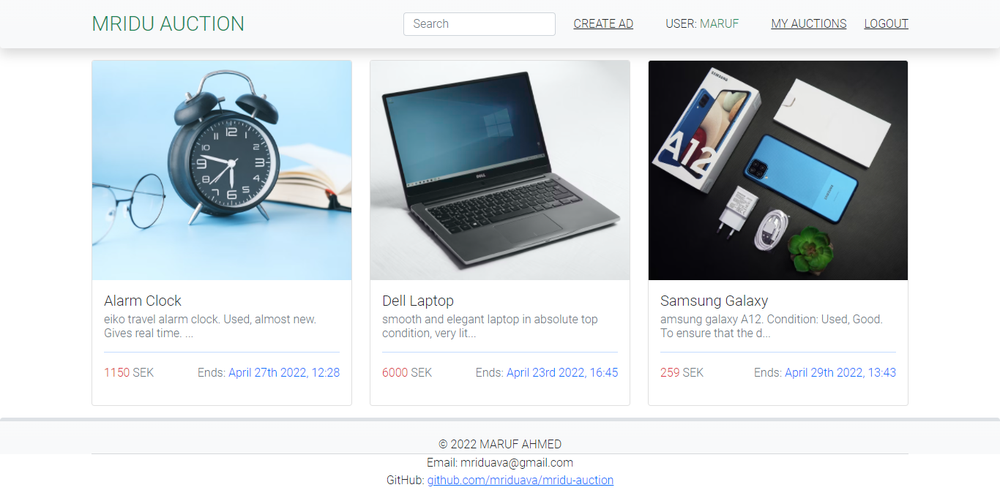
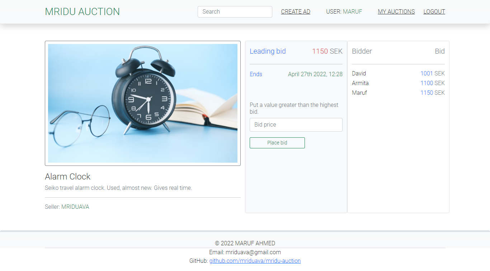
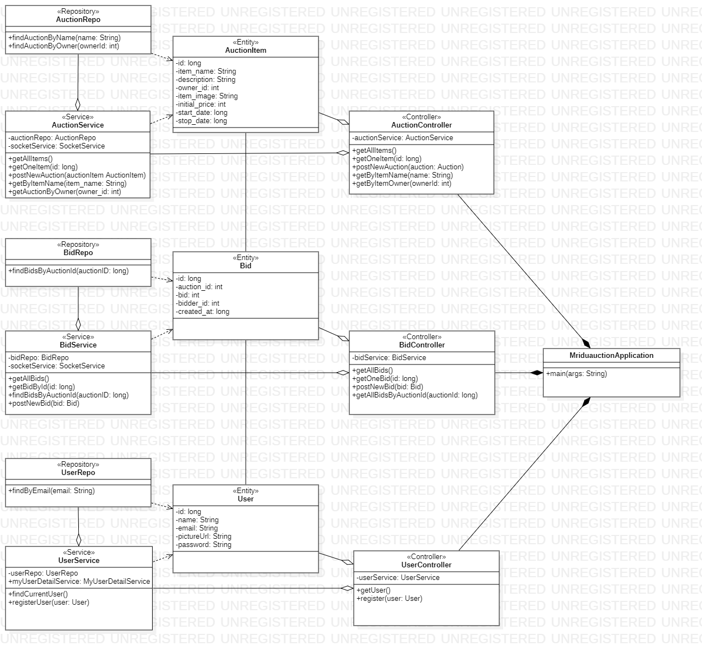
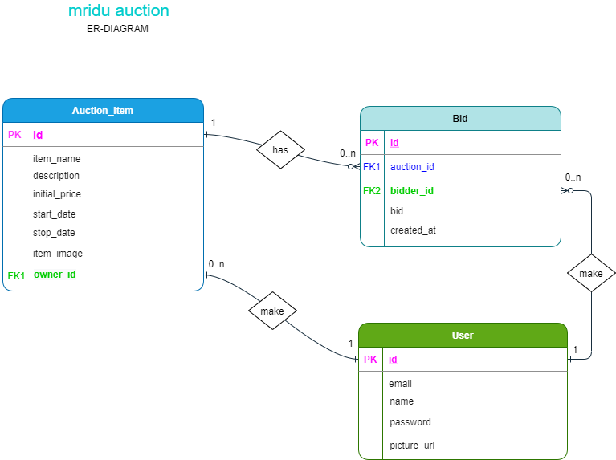

# MRIDU AUCTION (AUCTION SYSTEM)

An auction site where a user can create Auctions and can Bid at an Auction. Current bids update live on the screen for all visitors. That means all users from all locations using any browser can see the latest(leading) bids without refreshing the page. Fully responsive. Other functionalities are described below.

 
> Back end : JAVA, SPRING BOOT, WEBSOCKET, POSTGRESQL 
> Front end: REACT JS 
> Demo site: Coming soon... 

> @author: MARUF AHMED 
> @email : maruf.ahmed@live.se 
> @since : JULY 2021 

### OUTLOOK
#### HOME PAGE

 
#### DETAIL PAGE

 

### PLANNING
#### UML DIAGRAM

 
#### ER DIAGRAM

### FUNCTIONALITIES
* A visitor can see all auctions as a list'.
* A visitor is able to click on an item and can see the details for the auction.
* A visitor can see the latest bids without refreshing the browser.
* A visitor can register a new account.
* A user can login to his/her account.
* A user can create auction/s with 'item name', 'item description', 'item image', 'initial price', and 'expire date'.
* A user can bid to other user's auctions.
* A user can not bid less than or equal to the initial/leading price.
* A user can not bid to his/her own auction.
* A user can search 'auction item/s writing the item name partially/fully in the search input field.
* A user can see his/her own auction/s (if any) clicking on 'MY AUCTIONS'.

## `FRONTEND`
* Navigate to the "frontend" folder  
> cd frontend
* Install all dependencies. 
> npm install
* Run from command prompt
> npm start
* Open [http://localhost:3000](http://localhost:3000) to view it in the browser.

## `BACKEND (APIs)`
* Run PostgreSQL server. 
* Create a database with the name 'auctiondb' into Databases. Does not need to create tables into the 'auctiondb' database. 
* Open the 'backend' directory in intellij or in any other IDE 
* Run the main class,'MriduauctionApplication' inside src/main/java/com.mriduava.mriduauction
* Open http://localhost:9000 to view the API in the browser or in the Postman.
* API endpoints have been described below -

### `AUCTIONS`
--------------------------------
** GET
* Get all auctions as an array.
http://localhost:9000/api/auctions

** POST
* Create new aution
http://localhost:9000/api/auctions

** GET
* Get a particulat auction by its ID
http://localhost:9000/api/auctions/{id}

### BIDS
--------------------------------
** GET
* Get all bids
http://localhost:9000/api/bids

** POST
* Create a new bid
http://localhost:9000/api/bids

** GET
* Get bid of an auction item
http://localhost:9000/api/bids/{auctionId}

### USERS
---------------------------------
** GET
*Authenticate a user
http://localhost:9000/auth/user

** POST
* Register a user
http://localhost:9000/api/register
 

##  

&copy; 2021 MARUF AHMED  
Licensed under the [MIT License](LICENSE). 
